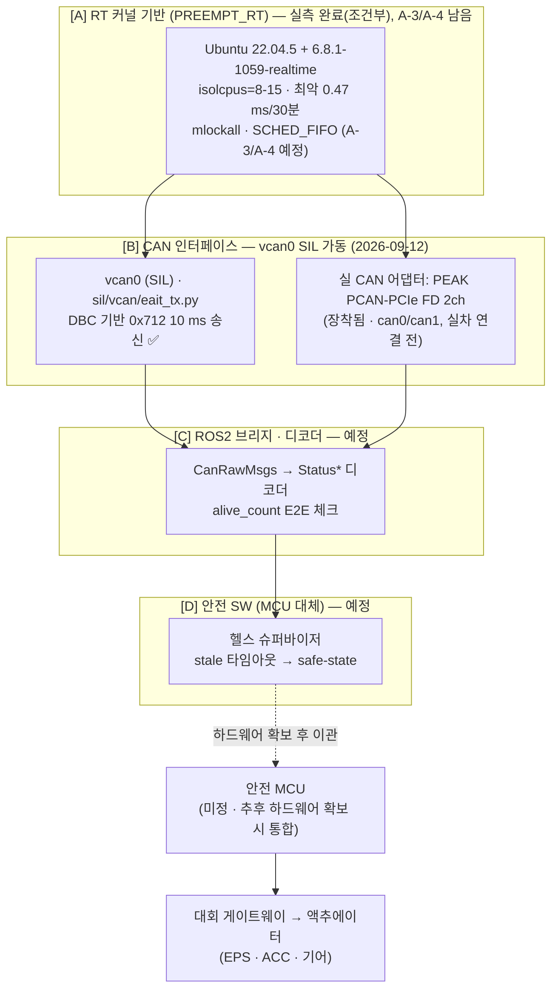
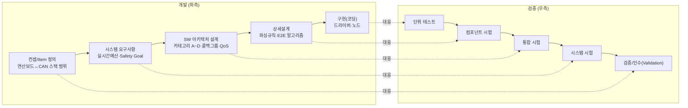

# CAN 스택 개발 문서 (메인 PC ↔ CAN)

> **이 문서의 역할**: 앞으로 이 프로젝트의 "바이브 코딩" 개발 세션이 참조하는 **살아있는 구현 스펙**. "왜 이렇게 설계했는가"의 근거·HARA 분석 전체는 [can_status_parameters_full.md](can_status_parameters_full.md)에 있고, 진행보드 Action Item은 같은 파일 §14에 있음. 이 문서는 **"무엇을·어떤 구조로 구현하는가"만** 담아 코딩 시 컨텍스트로 바로 쓸 수 있게 유지한다.
>
> **갱신 규칙**: 카테고리(§2) 단위로 섹션을 늘려간다. 새 내용을 추가할 때도 이 구조(아키텍처 다이어그램 → 카테고리 표 → 카테고리별 상세)를 유지할 것 — 흩어진 노트 형태로 쌓지 않는다.

---

## 0. 범위와 전제

- **하드웨어 부재**: 안전 MCU·실차 CAN 게이트웨이 아직 없음 → 메인 PC(Ubuntu 22.04)가 [8.1 연산보드 계층](can_status_parameters_full.md#81-권장-2계층-아키텍처)을 **단독으로** 구현하는 첫 마일스톤.
- **RT 커널 확정·설치·격리 튜닝·30분 실측 완료 (2026-09-12)**: Ubuntu 22.04.5 LTS + `6.8.1-1059-realtime` (Ubuntu Pro `linux-realtime-hwe-22.04`) + 격리 코어 8–15. 실측: 평균 4 µs, 99.9995 % 50 µs 이내, **최악 0.47 ms/30분** → CAN 스택 데드라인(10 ms)에는 충분, §7의 100 µs 최악값 목표는 미달(예산 재정의 필요) → §5.A.
- **CAN 어댑터는 이미 장착됨**: PEAK PCAN-PCIe FD 2채널(`can0`/`can1`, 커널 내장 드라이버 `peak_pciefd`). 실차 연결 전이라 개발은 계속 `vcan0` SIL로 진행.
- **개발 방식 = SIL(Software-in-the-Loop)**: 실물 CAN 대신 `vcan0` 가상 인터페이스 + 기록된 rosbag 재생으로 검증. 대회 DBC·실차 미수령.
- **대회 미수령 항목**: CAN ID 배치, 정수값→의미 매핑표(`enable`/`state`/`error*`/`gear`/`drive_mode`) — 확정 전까지 TODO로 명시하며 진행.

---

## 1. 아키텍처 개요



각 `[X]` 태그는 §2 카테고리 ID와 1:1 대응한다. 새 구현 내용은 반드시 이 다이어그램의 해당 박스를 갱신하고 §2 표의 상태를 바꾼 뒤, 대응 카테고리 섹션에 상세를 적는다.

---

## 2. 개발 카테고리

| ID | 카테고리 | 책임 범위 | 상태 | 상세 섹션 |
|---|---|---|---|---|
| A | RT 커널 기반 | PREEMPT_RT 설치·튜닝(`isolcpus`/`mlockall`/`SCHED_FIFO`), `cyclictest` 측정 | 🟡 조건부 완료 (커널·격리 튜닝·30분 실측 완료. 남음: 예산 재정의 결정, generic 비교, A-3/A-4) | §5.A |
| B | CAN 인터페이스 | 어댑터/SocketCAN, `vcan0` SIL 환경, rosbag→CAN 주입 | 🟡 진행중 (vcan0 영속화·왕복·DBC 기반 0x712 주기 송신·디코드 완료. 남음: ROS2 raw 퍼블리시=Phase C, 실 can0 전환) | §5.B |
| C | ROS2 브리지·디코더 | `CanRawMsgs`→`Status*` 파싱, E2E(`alive_count`) 체크, 콜백그룹/QoS | ⚪ 예정 | §5.C (추후 작성) |
| D | 안전 SW (MCU 대체) | 헬스 슈퍼바이저, stale 타임아웃→safe-state, HW 워치독 대체안 | ⚪ 예정 | §5.D (추후 작성) |
| E | 검증/테스트 (V-model) | 좌/우 대응 검증 계획, 고장주입 시험 | 🟢 초안 완료 | §3 |
| F | 안전등급 레퍼런스 (ASIL) | 41개 파라미터 ASIL 등급, 근거 | 🟢 초안 완료 | §4 |

상태 기호: 🟢 초안 있음 · 🟡 진행중 · ⚪ 미착수.

---

## 3. [E] V-model 검증 체크리스트

> HW 부재 단계라 우측 대부분은 **SIL(`vcan0`+rosbag 재생)** 수준. HIL/실차 시험은 MCU·실차 하드웨어 확보 후 별도 마일스톤으로 분리한다.



| 좌측 단계 | 이번 마일스톤 산출물 | 우측 검증 단계 | 검사 항목 |
|---|---|---|---|
| 컨셉/Item 정의 | "메인 PC↔CAN 인터페이스" 범위·경계 | 검증/인수 | rosbag 재생 시나리오로 전체 파이프라인이 원본 기록과 동등한 상태를 재현하는가 |
| 시스템 요구사항 (FSR 수준) | 실시간 예산표, Safety Goal | 시스템 시험 | `cyclictest`·ROS2 토픽 지연 실측이 데드라인 이내인가; `uname -a`/`/sys/kernel/realtime`로 PREEMPT_RT 적용 확인 |
| SW 아키텍처 설계 | 카테고리 A~D 구조, 콜백그룹 분리, QoS | 통합 시험 | `vcan0`+rosbag 주입 → 디코더 노드 전 구간 그래프 정상 동작; 제어 콜백이 인지/로깅 콜백에 안 밀리는지 |
| 상세설계 | CAN 프레임→구조체 파싱 규칙, E2E 체크 | 컴포넌트 시험 | 파서 단위 테스트(경계값), `alive_count` 롤오버(255→0) 테스트, 타임아웃 판정 로직 테스트 |
| 구현(코딩) | 드라이버 설치, 노드 코드 | 단위 테스트 | 정적분석(clang-tidy 등), 코드리뷰, CI 빌드 통과 |

**고장주입(fault injection) 시험 — H8/E2E 대응 필수 항목**
- [ ] CAN 프레임 드롭 주입 → safe-state 전환 시간 측정 (목표 ≤100 ms, H8)
- [ ] `alive_count` 고정(stuck) 주입 → 통신 두절 탐지 여부
- [ ] 체크섬/CRC 손상 프레임 주입 → 거부 여부
- [ ] 조향각/좌표 등 out-of-range 값 주입 → 범위 검증 로직 동작 확인
- [ ] 상위(Linux) 프로세스 강제 종료 → 폴백 로직(또는 향후 MCU 폴백) 트리거 확인

---

## 4. [F] ASIL 등급표 — 41개 통신 파라미터 (관례 기반)

**산정 방법(관례)**: ISO 26262는 원래 Safety Goal 단위로 ASIL을 부여하고 요구사항으로 하향 전개하는 것이 정석. 아래는 실무 편의상 각 파라미터를 [H1~H9](can_status_parameters_full.md#64-이-차량-hara-초안)(또는 토픽별 ASIL 맥락)에 **직접 매핑**해 상속시킨 간이표. 같은 필드명이 서로 다른 ASIL 도메인 메시지에 걸쳐 있으면(`enable`/`speed`/`accel`/`steer_angle` 등) **더 보수적인(높은) 등급을 채택**. 공식 HARA·대회 DBC 확정 전까지 **가정치**.

| # | 파라미터 | 소속 메시지 | 관련 Hazard | ASIL(관례) | 근거 |
|---|---|---|---|---|---|
| 1 | `is_init` | EPS/ACC | H1/H2 | **D** | 안전제어 활성화 게이팅 신호, 두 도메인 모두 D |
| 2 | `enable` | EPS/ACC | H1/H2 | **D** | 제어 활성화 상태 |
| 3 | `state` | EPS/ACC | H1/H2 | **D** | 상태머신 값 |
| 4 | `sequence` | EPS/ACC | H1/H2 | **D** | 제어 시퀀스 단계 |
| 5 | `error` | EPS/ACC | H1/H2 | **D** | 통합 에러 플래그 |
| 6 | `error_pd` | EPS/ACC | H1/H2 | **D** | 제어기(PD) 에러 |
| 7 | `error_sas` | EPS | H1 | **D** | 조향각센서 에러 |
| 8 | `error_vinfo` | EPS | H1 | **D** | 차량정보 에러 |
| 9 | `override` | EPS | H1 | **D** | 운전자 개입 감지 |
| 10 | `override_ignore` | EPS | H1 | **D** | 개입 무시 설정 |
| 11 | `steer_angle` | EPS(D)/Vehicle(C) | H1 | **D** | 보수적 상위값 채택 |
| 12 | `steer_torque` | EPS | H1 | **D** | 측정 조향 토크 |
| 13 | `steer_out_torque` | EPS | H1 | **D** | 출력 조향 토크 |
| 14 | `alive_count` | EPS/ACC(D)+INS(C) | H1/H2/H8 | **D**† | E2E 보호대상 최고등급 기준(† INS 단독 인스턴스는 C) |
| 15 | `error_tcu` | ACC | H4 | **B–C** | 변속기(TCU) 에러 — gear 오선택 계열 |
| 16 | `aeb_sequence` | ACC | H2/H3 | **D** | AEB 미작동=H2(D)가 보수적 상위 |
| 17 | `speed` | ACC(D)/Vehicle(C) | H2 | **D** | 보수적 상위값 채택 |
| 18 | `accel` | ACC(D)/Vehicle(C) | H2 | **D** | 보수적 상위값 채택 |
| 19 | `gear` | ACC | H4 | **B–C** | 기어 오선택, TCU inhibit 확인 시 완화 가능 |
| 20 | `accel_position` | Pedal | — | **B** | 피드백 전용 신호 등급 |
| 21 | `accel_switch` | Pedal | — | **B** | 〃 |
| 22 | `brake_position` | Pedal | — | **B** | 〃 |
| 23 | `brake_switch` | Pedal | — | **B** | 〃 |
| 24 | `brake_pressure` | Pedal | — | **B** | 〃 |
| 25 | `left`(방향지시등) | Turn | H9 | **QM–A** | 등화 |
| 26 | `right`(방향지시등) | Turn | H9 | **QM–A** | 등화 |
| 27 | `emergency`(비상등) | Turn | H9 | **QM–A** | 등화 |
| 28 | `front_left`(휠속) | Wheel | H6 보조 | **C** | 휠 오도메트리 등급 |
| 29 | `front_right`(휠속) | Wheel | H6 보조 | **C** | 〃 |
| 30 | `rear_left`(휠속) | Wheel | H6 보조 | **C** | 〃 |
| 31 | `rear_right`(휠속) | Wheel | H6 보조 | **C** | 〃 |
| 32 | `yaw_rate` | INS | H6 | **C** | H6 자체는 C–D 범위, 팀 재확인 필요 |
| 33 | `filtered_yaw_rate` | Vehicle | H6 | **C** | 통합상태 HUD 등급 |
| 34 | `pos_x` | Vehicle | H6 | **C** | 〃 |
| 35 | `pos_y` | Vehicle | H6 | **C** | 〃 |
| 36 | `heading` | Vehicle | H6 | **C** | 〃 |
| 37 | `drive_mode` | std_msgs | H7 | **D** | 모드 중재 |
| 38 | `current_angle` | std_msgs (피드백) | H1 검증 | **C** | 명령 반영 확인 |
| 39 | `current_speed` | std_msgs (피드백) | H2 검증 | **C** | 〃 |
| 40 | `target_angle` | std_msgs (명령 에코) | H1 검증 | **C** | 〃 |
| 41 | `target_speed` | std_msgs (명령 에코) | H2 검증 | **C** | 〃 |

**등급별 집계**: D 18개 · C 13개 · B 5개 · B–C 2개 · QM–A 3개 (합계 41)

> ⚠️ ISO 26262 정석은 신호가 아니라 Safety Goal에 ASIL을 매기고, 이후 **ASIL 분해(decomposition)**로 하위 요소 등급을 낮출 수 있음. 위 표는 그 전 단계의 실무 간이 매핑. 공식 HARA 확정 시 특히 `alive_count`(EPS/ACC vs INS 분리 여부)·`error_tcu`/`gear`(TCU inhibit 여부)·`yaw_rate`(H6 C 대 C–D)는 재검토 1순위.

---

## 5. 카테고리별 상세 — 추후 작성

구현이 진행되는 대로 아래 형식으로 채운다: **목적 → 인터페이스(토픽/함수 시그니처) → 파일/모듈 위치 → 완료 기준(§3 검증 항목과 연결)**.

### 5.A RT 커널 기반

**왜 필요한가**
- Vanilla 리눅스 스케줄러(CFS)는 처리량·공정성 최적화 → 개별 태스크의 **최악 지연(worst-case latency)** 보장이 없음.
- 지연 원인: 커널 비선점 구간(스핀락 보유 중엔 인터럽트도 못 끼어듦) · 인터럽트 핸들러가 우선순위 무관하게 즉시 실행 · 우선순위 역전(priority inversion, 낮은 우선순위 태스크가 잡은 락을 높은 우선순위 태스크가 기다리는데 중간 우선순위 태스크가 낮은 쪽을 밀어냄) · `SCHED_OTHER`(CFS)의 스케줄링 지터.
- 이 프로젝트 영향: 제어 루프 10ms, E2E 브리지 100Hz 등 §7 데드라인을 지키려면 **평균이 아니라 99.9퍼센타일/최댓값**이 예산 안에 들어야 함. 200km/h에서 100ms 지연 = 5.6m 블라인드 — vanilla 커널의 수~수십 ms 스파이크는 이 속도대에서 그대로 사고 리스크.

**PREEMPT_RT가 바꾸는 것**
- 대부분의 스핀락 → 선점 가능한(sleepable) 뮤텍스
- 인터럽트 핸들러 → 우선순위 지정 가능한 커널 스레드(threaded IRQ), `chrt`로 우리 제어 태스크보다 낮게 배치 가능
- 우선순위 상속(priority inheritance)으로 우선순위 역전 방지
- 효과: 최악 스케줄링 지연 수 ms~수십 ms → **수십~100 µs 급**. Linux 6.12에 메인라인 병합됨.

**RT 커널만으로는 부족 — 반드시 같이 적용**
- 임계 태스크에 `SCHED_FIFO`/`SCHED_DEADLINE` + `chrt`로 명시적 우선순위 부여
- `isolcpus`/`nohz_full`/`rcu_nocbs` + IRQ affinity로 RT 태스크 전용 격리코어 확보
- `mlockall(MCL_CURRENT|MCL_FUTURE)`로 페이지폴트(=디스크 I/O=수 ms 지연) 원천 차단
- `cyclictest`로 반드시 실측 — "커널 깔았다"가 완료가 아니라 "쟀더니 목표치 이내였다"가 완료

**커널 결정 (2026-09-12 확정)**

| 항목 | 값 |
|---|---|
| OS | **Ubuntu 22.04.5 LTS (jammy)** — 24.04 아님. ROS2 Humble 유지, Jazzy 이전 불필요 |
| RT 커널 | **`6.8.1-1059-realtime`** (`uname -v`: `#60~22.04.1-Ubuntu SMP PREEMPT_RT`) |
| 패키지 | `linux-realtime-hwe-22.04` = `6.8.1-1059.60~22.04.1`, 출처 `esm.ubuntu.com/realtime jammy` (Ubuntu Pro) |
| 비RT 커널 | `6.8.0-138-generic` (HWE) — 기본 부팅·롤백용으로 유지 |
| 하드웨어 | i7-12700 (P코어 8개 = CPU 0–15 하이퍼스레드, E코어 4개 = CPU 16–19), 62 GB, RTX A5000, PEAK PCAN-PCIe FD 2ch, WiFi = USB 동글 RTL8822BU |

선정 경위 — "왜 이 커널인가"를 다시 파헤치지 않도록 남긴다.
- **기존 RT 커널 `5.15.0-1114-realtime`은 폐기.** WiFi 동글 드라이버 `rtw88_8822bu`가 Linux 6.2부터 들어가서 5.15에는 코드가 없고(펌웨어·rfkill 문제 아님), NVIDIA 470 DKMS가 PREEMPT_RT 커널 빌드를 거부해 GPU도 쓸 수 없었다. (인수인계 문서의 "5.11-rt / 6.11"은 실제 장비와 달랐다 — 실측 결과는 5.15-rt / 6.8 generic.)
- **"같은 OS면 드라이버도 같이 해결된다"는 가설은 기각.** userspace(펌웨어 파일, NetworkManager)는 공유되지만 드라이버 본체는 커널 버전별 별도 코드다. 해결책은 "무선이 되는 커널 세대에서 RT를 구성하는 것".
- **6.12 LTS 자체 빌드(메인라인 PREEMPT_RT) 대신 6.8.1-rt를 택한 이유**: 무선이 되던 6.8 generic과 같은 기반이고, 배포판이 빌드·보안패치를 제공하며, 22.04에서 바로 설치된다(24.04 업그레이드 불필요). 대회 일정 리스크 최소화가 최신성보다 우선. 6.12 계열 이관은 대회 후 재검토하며, 아래 측정표가 비교 기준이 된다.
- **블루투스는 해당 없음**: 이 PC에는 BT 하드웨어 자체가 없다(6.8 generic에서도 `/sys/class/bluetooth` 없음). 필요하면 USB BT 동글 구매 — `btusb`는 모든 커널에 내장.

**이행 호환성 판정 (2026-09-12, 6.8.1-1059-realtime 실부팅 기준)**

| 항목 | 결과 | 비고 |
|---|---|---|
| WiFi (RTL8822BU, `rtw88_8822bu`) | ✅ 연결 | generic에서도 `firmware failed to leave lps state` 반복(절전 버그) → 주행 중 무선 비활성 권고 |
| CAN (`peak_pciefd`) | ✅ `can0`/`can1` | 커널 내장 드라이버, out-of-tree 없음 |
| GPU (RTX A5000, NVIDIA 470.256.02-server) | ⚠️ 동작 — 잠재 결함 | NVIDIA는 PREEMPT_RT **공식 미지원**. DKMS에 `IGNORE_PREEMPT_RT_PRESENCE=1` 우회 빌드(`/etc/dkms/framework.conf`). 정상 운용(GPU 83% 부하 30분 포함 57분)에서는 커널 경고 0건. **GPU 프로세스 비정상 종료 상황에서 `BUG: scheduling while atomic: irq/219-s-nvidia` 10회** 관측(아래 참조). 커널 업데이트 때마다 재빌드 확인 필요 |
| 유선 NIC(e1000e·ixgbe·igc·atlantic), LTE 모뎀 | ✅ | 커널 내장 |
| Secure Boot / 루트 FS | 비활성 / ext4 | 서명·부팅 문제 없음 |
| 하드웨어 지연 (`hwlatdetect`, 20 µs 기준) | ✅ 0건 (2회) | BIOS SMI 원인 없음 → 소프트웨어 튜닝이 유효 |
| Bluetooth | 해당 없음 | 하드웨어 없음 |

**부팅 구성·롤백 경로**
- GRUB 메뉴를 매 부팅 **10초 표시**, 서브메뉴 없이 커널 나열, **아무것도 안 누르면 `6.8.0-138-generic`**. 무한 대기는 차량에서 무인 재부팅 시 멈추면 안 되므로 쓰지 않는다. (드롭인 `/etc/default/grub.d/99z-a1-bsw-safe-default.cfg`)
- 메뉴 항목: generic(기본) / `6.8.1-1059-realtime` / **`A1-BSW: … + RT 튜닝`**(`/etc/grub.d/11_a1_bsw_rt_tuned`, id `a1-bsw-rt-tuned`) / `5.15.0-1114-realtime`(구, 정리 예정)
- 튜닝 항목으로 1회만 부팅: `sudo grub-reboot a1-bsw-rt-tuned && sudo reboot` — 부팅이 멈추면 전원 재시작만으로 generic 복귀
- 이행·측정 스크립트: 메인 PC `tools/rt/a1_rt.sh` (`pin`/`install`/`verify`/`hwlat`/`tune`/`bench`/`soak`/`rollback`), 모든 출력은 `tools/rt/logs/` (git 추적 제외; 2026-09-12 핵심 로그는 `measurements/2026-09-12_rt/`)

**검증 방법**
- `uname -a`에 `PREEMPT_RT` 표기 확인, `cat /sys/kernel/realtime` → `1`
- `cyclictest -p 99 -m -i 1000 -l 100000` 등으로 **무부하 + CPU 부하 + CPU+GPU 부하** 세 조건에서 최댓값 비교 (GPU 부하 조건은 2026-09-12 추가 — NVIDIA 비공개 드라이버가 RT 지연의 주요 위험원이므로)
- `hwlatdetect --duration=60 --threshold=20`으로 BIOS/SMI 하드웨어 지연 배제
- §3 V-model "시스템 요구사항 ↔ 시스템 시험" 행과 직결

**완료 기준**: PREEMPT_RT 부팅 확인 + 무부하/부하 상태 `cyclictest` 최댓값을 기록하고 §7(can_status_parameters_full.md) 데드라인과 대조해 여유가 있음을 확인. **짧은 측정(수십~100초)은 드문 스파이크를 놓치므로, 격리 코어 튜닝 상태에서 CPU+GPU 부하 30분 이상 장시간 측정까지 통과해야 완료로 본다** (2026-09-12 추가).

**cyclictest 실측 절차 (2026-09-11 수정: before/after 비교 생략, PREEMPT_RT 설치 후 절대 기준(§7 예산) 통과 여부만 확인)**

> 📝 판단 기준을 "RT 전/후 비교"에서 **"RT 후 값이 요구사항(§7)을 만족하는가"**로 단순화함 (팀 결정, 2026-09-11). vanilla 커널로는 이미 실시간성 보장이 안 된다는 게 업계에 잘 알려져 있어 굳이 증명할 필요 없음 — 지금 급한 건 "우리 목표치를 만족하는 바닥선이 나오는가"뿐. GRUB에 이전 커널이 그대로 남아있으므로, 나중에 보고서 등에서 정말 전/후 비교가 필요해지면 그때 옛 커널로 재부팅해서 재측정하면 됨 (지금 손해보는 것 없음).

**Step 0 — PREEMPT_RT 커널로 실제 부팅됐는지 확인** (설치했다고 자동으로 그걸로 부팅되는 게 아님, GRUB에서 커널을 고르는 것)
```bash
uname -r                     # 이름에 rt가 들어있는지 확인
cat /sys/kernel/realtime     # 파일이 없으면 RT 아님, 1이 나오면 RT로 부팅된 것
```

**Step 1 — cyclictest 설치**
```bash
sudo apt update && sudo apt install -y rt-tests
```

**Step 2 — 감 잡기용 최소 실행** (Ctrl+C로 종료)
```bash
sudo cyclictest
```

**Step 3 — 실제로 판단에 쓸 측정** (8코어, 약 100초)

> ⚠️ **2026-09-12 수정: `-N` 제거.** `-N`(ns 출력)을 쓰면 값과 히스토그램 단위가 ns가 되어 `-h 400`이 0–400 **ns**만 추적한다(거의 모든 샘플이 범위 초과). µs 단위로 재야 `-h 400` = 0–400 µs가 된다.

```bash
sudo cyclictest -p 99 -m -i 1000 -l 100000 -t 8 -a -q -h 400 > ~/cyclictest_rt_floor_$(date +%Y%m%d).log
tail -n 20 ~/cyclictest_rt_floor_*.log
```

> ⚠️ **격리 코어(`isolcpus`)에서 잴 때는 반드시 `taskset`으로 감싼다** (2026-09-12 실측 중 발견). `isolcpus`가 켜지면 새 프로세스의 허용 CPU가 격리 코어 밖(`0-7,16-19`)으로 제한되고, cyclictest는 `-a` 목록을 그 허용 범위 안에서만 해석해 `FATAL: No allowable cpus to run on`으로 즉시 죽는다. `-a`의 인자는 붙여 쓴다(선택 인자).

```bash
# 격리 코어 8-15 측정: 허용 범위를 전체 CPU로 넓히고, 관리(main) 스레드는 하우스키핑 코어에
sudo taskset -c 0-19 cyclictest -p 99 -m -i 1000 -l 100000 -t 8 -a8-15 --mainaffinity=0-7,16-19 -q -h 400
```

**Step 4 — 부하 상태에서도 확인** (카메라/LiDAR 처리 흉내)
```bash
sudo apt install -y stress-ng
sudo stress-ng --cpu 8 --io 4 --vm 2 --vm-bytes 1G --timeout 70s &
sleep 3
sudo cyclictest -p 99 -m -i 1000 -l 60000 -t 8 -a -q -h 400 > ~/cyclictest_rt_floor_load_$(date +%Y%m%d).log
```

**Step 5 — CPU + GPU 부하** (2026-09-12 추가 — 인지 파이프라인 흉내. CUDA 툴킷이 없어 OpenGL 벤치마크로 GPU 부하)
```bash
sudo apt install -y glmark2
glmark2 --off-screen --run-forever -s 3840x2160 -b refract &   # 데스크톱 세션에서 일반 사용자로 실행
# ⚠️ -b refract 필수: 기본 장면 순환의 terrain 장면은 NVIDIA 470 이 셰이더를 컴파일하지 못해
#    (error C0502: syntax error at token "highp") glmark2 가 segfault 한다 — RT 커널과 무관한 도구 문제.
#    refract 한 장면 반복 시 GPU 사용률 ~87%, 안정적 (2026-09-12 확인)
sudo stress-ng --cpu 8 --io 4 --vm 2 --vm-bytes 1G --timeout 70s &
sleep 5
sudo cyclictest -p 99 -m -i 1000 -l 60000 -t 8 -a -q -h 400 > ~/cyclictest_rt_floor_gpu_$(date +%Y%m%d).log
```
Step 3~5 + `hwlatdetect`를 한 번에: 메인 PC에서 `sudo bash tools/rt/a1_rt.sh bench` (약 5분, 격리 코어가 있으면 자동으로 그 코어에서 측정). 장시간 측정은 `sudo bash tools/rt/a1_rt.sh soak 30`.

- 판단 기준은 각 스레드의 `Max`(최악 지연) — `Avg` 아님. 사고는 꼬리(tail)에서 남.
- 8개 스레드 중 **가장 큰 Max**가 "이 컴퓨터+이 커널이 보장하는 실시간성의 바닥선".

**측정 결과 (§7 목표: 최악 지연 수십~100 µs 급)**

| 구분 | 무부하 Max | CPU 부하 Max | CPU+GPU 부하 Max | 측정 CPU | 측정일시 | 커널 |
|---|---|---|---|---|---|---|
| RT, 튜닝 전 — 1차 | 116 µs (CPU 6) | **882 µs (CPU 6, 1회)** | 미측정 | 0–7 | 2026-09-12 15:18 | `6.8.1-1059-realtime` |
| RT, 튜닝 전 — 2차 | 65 µs (CPU 6) | 23 µs | 20 µs (GPU 83%) | 0–7 | 2026-09-12 16:01 | `6.8.1-1059-realtime` |
| RT + 격리 튜닝, 30분 — **1차(참고용, 부하 불안정)** | — | 839 µs | (GPU 도구 3.5분 뒤 크래시, 코어덤프·병행 시험·NVIDIA BUG 10회 겹침) | 8–15 | 2026-09-12 16:52–17:23 | `6.8.1-1059-realtime` |
| RT + 격리 튜닝, 5분 (ftrace 추적 중) | — | — | **33 µs** (GPU+CPU 부하 안정) | 8–15 | 2026-09-12 17:36–17:41 | `6.8.1-1059-realtime` |
| **RT + 격리 튜닝, 30분 — 2차(정식)** | — | — | **467 µs** (GPU 83% 유지 + CPU·메모리·I/O 부하) | 8–15 | 2026-09-12 17:47–18:17 | `6.8.1-1059-realtime` |
| **RT + 격리 튜닝, 8시간 야간 (합성 상한 부하)** | — | — | **828 µs** (GPU 81 % + CPU·메모리·I/O; 400 µs 초과 231회 = 65 에피소드, **전부 CPU 12·13**; 1 ms 초과 0; 스로틀 0) | 8–15 | 2026-09-14 21:20–09-15 05:21 | `6.8.1-1059-realtime` |
| **RT + 격리 튜닝 + 전원관리 차단(idle=poll, pstate off), 30분** | — | — | **43 µs** (GPU 78 % + CPU·메모리·I/O; 50 µs 초과 0회, 8코어 16~43 µs) | 8–15 | 2026-09-15 14:52–15:22 | `6.8.1-1059-realtime` |
| **generic + 격리 튜닝 + `preempt=full`, 30분 (대조군)** | — | — | **935 µs** (GPU 80 % 유지 + CPU·메모리·I/O; 400 µs 초과 9회, 100 µs 초과 324회, 50–100 µs 748회) | 8–15 | 2026-09-14 12:00–12:30 | `6.8.0-138-generic` |

- 평균(Avg)은 모든 조건에서 1–5 µs. 판단은 항상 Max 기준.
- `hwlatdetect`(20 µs 기준) 2회 모두 초과 0건 → 하드웨어·BIOS 요인 배제.
- 측정 중 커널 경고(`BUG:`/`scheduling while atomic`/`Call Trace`/NVRM 오류) 0건 — NVIDIA×RT 충돌 징후 없음.

**판정 (2026-09-12, 정식 30분 측정 후): 조건부 통과 — 꼬리(tail) 0.5 ms 🟡**

정식 2차 30분 측정(GPU 83% + CPU·메모리·I/O 부하, 격리 코어 8–15, 1,440만 샘플):

| 구간 | 횟수 | 비율 |
|---|---|---|
| 50 µs 미만 | 14,399,898 | 99.9993 % |
| 50–100 µs | 29 | |
| 100–200 µs | 47 | |
| 200–400 µs | 24 | |
| 400 µs 초과 | 2 (최악 467 µs) | 30분에 1사건 — 스레드 1·7이 **같은 사이클**에 기록 → 시스템 전체에 걸린 단일 사건 |

- 평균 3.9 µs. §7 목표(수십~100 µs)를 **99.9995 %의 주기에서 만족**하지만, 최악값 기준으로는 미달(0.47 ms). 약 18초에 한 번 50 µs를 넘고, 30분에 한 번 0.4 ms를 넘는다.
- 1차 30분의 839 µs·93회는 **측정 환경이 오염된 결과**다: GPU 부하 도구(glmark2)가 3.5분 만에 크래시(NVIDIA 470의 셰이더 컴파일 실패 — RT와 무관)하며 21 MB 코어덤프·크래시 보고가 돌았고, 같은 시간대에 원인 조사용 시험이 병행됐으며 NVIDIA BUG 10회가 겹쳤다. 참고용으로만 남긴다.
- 정식 2차 부팅(57분 가동, 그중 30분 GPU 부하)에서는 **NVIDIA BUG 0회**. BUG는 GPU 프로세스가 비정상 종료되는 상황에서 나타난 것으로 보이며, 정상 운용에서는 재현되지 않았다. 다만 잠재 결함이므로 대회 중 GPU 프로세스 크래시는 지연 사건으로 간주해야 한다.
- 원인 후보: 격리 코어에 장치 인터럽트는 0건. GPU 활동 시 격리 코어에 CPU 간 호출 인터럽트(IPI)가 유입(1080p 5회/초, 4K 83% 부하 시 ~20회/초)하며 이는 `isolcpus`로 막을 수 없다. stress-ng(CPU·메모리·I/O)는 IPI 0회. 5분 ftrace 추적(`trace 5 300`)은 임계 초과가 없어 발동하지 않았다 — 0.4 ms 사건은 30분에 1회 수준이라 **`trace 30 300`**으로 잡아야 한다.
- BIOS/SMI: `hwlatdetect` 60초 2회 0건.

**결론**: 이 하드웨어(NVIDIA GPU 동거) + RT 커널 + 격리 튜닝으로 얻을 수 있는 실시간성은 **"평균 4 µs, 99.9995 % 50 µs 이내, 최악 ~0.5 ms/30분"**이다. CAN 스택 데드라인(제어 10 ms, 0x156 TX 10 ms, 차량측 타임아웃 1000 ms) 대비 0.5 ms는 주기의 5 %로, **CAN 스택 구현(Phase B 이후)을 진행하는 데 지장이 없다**. §7의 "수십~100 µs" 목표는 이 구성에서 최악값으로는 달성 불가하므로 **팀이 예산을 "최악 1 ms 이내, 99.99 % 100 µs 이내"로 재정의하거나, 100 µs급 보장이 정말 필요한 루프는 MCU로 이관**해야 한다.

**참고 — 1차(튜닝 전)의 882 µs 스파이크 1회 조사:**
- WiFi 오류 로그와 시각 불일치(스파이크 15:20:34 전후, WiFi 오류 15:21:40), CPU 6에는 WiFi(CPU 9)·GPU(CPU 13)·NVMe 등 주요 장치 IRQ 없음, 측정 직전 apt 설치는 측정 시작 전(15:18:17) 종료, `hwlatdetect` 0건 → 알려진 후보는 모두 배제됨.
- 2차 60초 측정에서 재현되지 않음. 10 ms 제어 주기 기준 882 µs는 주기의 9%로 데드라인 위반은 아니지만, §7 목표선은 넘는다.
- → **장시간 측정(soak 30분+)에서 재발하지 않는 것을 확인하기 전까지 "통과"로 확정하지 않는다.**

**⚠️ NVIDIA × PREEMPT_RT 커널 BUG (2026-09-12 17:00~17:18, 1차 30분 측정 중 10회 — 정식 2차 측정에서는 0회)**
- 메시지: `BUG: scheduling while atomic: irq/219-s-nvidi` (CPU 3 — 하우스키핑 코어), 2쌍 4회. 시스템은 계속 동작.
- 경로: `nvidia_isr_kthread_bh` → `rm_isr_bh` → `nv_post_event` → `kmalloc` → `___slab_alloc` → `rt_spin_lock` → `schedule_rtlock`. NVIDIA 드라이버가 선점을 막은 상태에서 메모리를 할당하는데, PREEMPT_RT에서는 할당기의 잠금이 **잠들 수 있는 잠금**이라 "잠들면 안 되는 곳에서 잠듦" BUG가 난다. NVIDIA가 RT를 지원하지 않는 이유가 바로 이것.
- 튜닝 전 RT 부팅 2회(60초 GPU 부하 포함)에서는 0회. 할당기가 느린 경로(잠금 필요)로 빠질 때만 드러나는 잠재 결함으로, 장시간 메모리 부하에서 확률적으로 나타나는 것으로 판단.
- 촉발 요인: GPU 부하 도구(glmark2)가 크래시로 비정상 종료된 직후 시간대에 집중. 정상 운용(GPU 83% 부하 30분)에서는 0회 → **GPU 프로세스 비정상 종료·컨텍스트 정리 경로**에서 나타나는 것으로 추정.
- 의미: 격리 코어 밖에서 났지만 커널 수준 잠금 규칙 위반이라 드물게 지연 스파이크·멈춤으로 번질 수 있다. **운용 규칙**: 대회 중 GPU 프로세스(인지 노드)가 크래시하면 그 시점을 실시간성 상실로 간주하고 안전 SW(§5.D)가 감지·대응해야 한다. 근본 해소는 NVIDIA 최신 브랜치 재시험 또는 RT 포기(generic+preempt=full) — 비교 측정 항목으로 유지.

**튜닝 파라미터 (A-1/A-2) — `A1-BSW: … + RT 튜닝` 부팅 항목**

| 파라미터 | 의도 |
|---|---|
| `isolcpus=managed_irq,domain,8-15` | 물리 P코어 4–7(하이퍼스레드 양쪽)을 RT 전용으로 격리 |
| `nohz_full=8-15` `rcu_nocbs=8-15` `rcu_nocb_poll` | 격리 코어의 주기 타이머·RCU 콜백 제거 |
| `irqaffinity=0-7,16-19` | 인터럽트를 격리 코어 밖(나머지 P코어 + E코어)으로 |
| `intel_idle.max_cstate=1` `processor.max_cstate=1` | 깊은 절전 복귀 지연 제거 (유휴 전력·발열 증가는 감수) |
| `nmi_watchdog=0` `nosoftlockup` `skew_tick=1` | 주기적 감시·틱 동시성에서 오는 지터 감소 |

> ⚠️ **격리 코어에는 명시적으로 배치한 태스크만 실행된다.** ROS2 제어 노드를 `taskset -c 8-15` + `chrt -f`로 띄우지 않으면 격리 코어는 그냥 놀게 되고 지연 개선 효과도 없다(A-3). 위 cyclictest 실패와 같은 이유다 — 격리 코어 밖에서 시작한 프로세스는 `taskset`/`sched_setaffinity`로 옮겨야만 격리 코어를 쓴다. 가장 결정적인 구성이 필요하면 물리 코어당 한 스레드만 사용(예: 8·10·12·14)하고 형제 스레드는 비워 둔다.
>
> **격리 코어에 남는 인터럽트 (A-2 확인 결과)**: NVMe 디스크의 CPU별 큐 8개(`nvme0q5`~`q12`, IRQ 163~170)가 CPU 8~15에 하나씩 배정돼 있다. 커널이 관리하는 인터럽트라 사용자가 옮길 수 없지만, **그 CPU에서 디스크 I/O를 할 때만 발생**하므로 튜닝 부팅 후 발생 0회였다. → **격리 코어의 RT 태스크는 디스크 I/O를 하지 않는다** (로그는 하우스키핑 스레드로 넘겨 기록).

**남은 작업 (Phase A 잔여)**
1. ✅ 튜닝 항목 부팅 확인 (2026-09-12 16:36) — `/proc/cmdline`에 튜닝 파라미터 반영, `isolated` = `nohz_full` = `8-15` (A-1). 격리 코어의 장치 인터럽트는 NVMe CPU별 큐뿐이며 발생 0회 (A-2)
2. ✅ `soak 30` 2회 완료 (2026-09-12) — 정식 2차: 최악 467 µs, 99.9995 % 50 µs 이내 (위 판정 참조)
3. ✅ 비교·원인 측정 완료 (2026-09-14~15): generic 대조군 30분(D1 = RT 유지), trace 30 300 포착(패키지 단위 깨어남 지연), 8시간 야간(최악 828 µs, 1 ms 초과 0), 장치 IRQ 계수(격리 코어 0건), 스레드별 분해(200 µs+ 공통 사건 8코어 균등, 코어 6은 증폭기). 상세는 `2026-09-14_can_verification_checklist.md` 1-1~1-6 과 `measurements/2026-09-1{4,5}_*/README.md`.
   - **팀 결정 D4**: §7 실시간 예산을 "최악 1 ms, 99.99 % 100 µs"로 재정의 — 8시간 실측이 이를 충족(최악 0.83 ms, 99.9985 % < 50 µs). 회의 안건.
   - **1-6b~1-6f 전원관리 실험 (2026-09-15~16) — 결론과 정정.** 9/15 에 "원인 = C-state·주파수 전이 확정"으로 썼던 판정은 **과했다.** 이후 실험으로 밝혀진 것:
     - 튜닝 부팅의 cpuidle 은 원래 **POLL 하나뿐**(C-state 는 처음부터 원인 아님, C3), 클럭 고정은 무효(C2 899 / C3 837 µs), HWP 끔 단독 무효(B1 640), `idle=poll` 단독 무효(B2 813), **둘을 함께** 쓴 B 만 43 µs 이고 재현됨(157 µs, 200 µs 초과 0).
     - 정확한 표현: **`idle=poll` 과 `intel_pstate=disable` 의 조합이 필요조건** — cpuidle 프레임워크 경로와 intel_pstate/HWP 경로가 함께 작용해 수백 µs 사건을 만든다. 기전은 가설, 운용 결정에는 불필요.
     - generic 에 같은 두 옵션을 줘도 514 µs / 50 µs 초과 1,889회(1-1b) → **D1 최종: RT 유지.** RT 의 NVIDIA 비공식 빌드 위험은 운용 규칙으로 안는다.
     - 폴링 비용: 격리 SMT 짝 offline 은 스파이크를 되살림(498 µs, offline 스레드가 깊은 C-state 로 들어가기 때문으로 추정) → 기각. **격리 코어 800 MHz 고정(`iso_pm.sh eco 800`)은 67 µs / 50 µs 초과 1** → 채택.
     - 유휴 전력: `performance` + `idle=poll` 은 부하 없이도 **패키지가 PL1 35 W 한도에 걸린다**(20스레드 터보 폴링). `schedutil` 은 PREEMPT_RT 에서 IRQ 스레드(FIFO)를 보고 항상 최대를 골라 무효. **하우스키핑 `ondemand`(`iso_pm.sh hk ondemand`)로 유휴 35 → 14 W, 45 → 37 °C**, 30분 soak **최악 27 µs, 50 µs 초과 0** — 전 실험 최선. 하우스키핑 클럭 전이는 격리 지연과 무관(C3 + 이번).
   - ✅ **운용 설정 확정 (2026-09-16)**: 부팅 **`a1-bsw-rt-poll`** (RT 튜닝 + `idle=poll intel_idle.max_cstate=0 processor.max_cstate=0 intel_pstate=disable cpufreq.default_governor=performance`) + 부팅 후 **`tools/rt/iso_pm.sh eco 800`** + **`tools/rt/iso_pm.sh hk ondemand`**. 런타임 두 줄은 A-3 systemd 유닛에 넣어 자동화한다(승인 후). GRUB 기본은 여전히 generic. 상세: `measurements/2026-09-16_{bisect,generic_poll,eco}/README.md`, 체크리스트 1-6e/1-6f/1-1b.
   - ✅ **운용 설정 8시간 무인 (9/16 22:22~06:22)**: 최악 **920 µs**, 100 µs 초과 51건(0.000022 %), 200 µs 초과 31, 400 µs 초과 26 = **전역 동시 에피소드 3개**(00:07, 06:12 ×2). 9/14 8h 대비 200 µs 초과 46배 감소(1,424 → 31). **D4 충족**(최악 ≤ 1 ms 여유 8 %, 100 µs 초과 ≤ 0.01 % 450배 여유). 에피소드 2·3은 WiFi 재연결 + PackageKit 저장소 갱신과 5초 안에 겹침, 1은 USB WiFi(rtw88) LPS 메시지 근처. `measurements/2026-09-17_8h_prod/`.
   - **9/17 후속**: 양성 대조(운용 설정 + WiFi off/on·pkcon 유발, 30분) → **에피소드 130개**(조용히 30분 = 0) → 네트워크·패키지 활동이 스톨의 증폭 인자임을 확정. 그러나 **재부팅 뒤** 같은 유발을 걸면 어떤 설정(순정/ondemand만/eco만/운용)에서도 3분에 0개 → 필요조건은 **장시간 가동 중 누적되는 상태**(미확인; 같은 부팅의 8h 는 3개뿐, 06:22~14:08 사이 발생). IPI·IRQ·SMI·커널 이벤트·전력 과도(ondemand 4.1 GHz·72 W·EDP 제한 비트 찍혀도 0)는 전부 아님. `measurements/2026-09-17_{provoke,hw_quick}/`.
   - **운용 규칙(안)**: 부팅 `a1-bsw-rt-poll` + `eco 800` + `hk ondemand` + **WiFi/WWAN 라디오 끔·PackageKit/snapd/apt 계열 정지**(`soak_guard on race`) + **주행 전 새로 부팅**.
   - **🔜 다음**: 대회 조건 8h → 재부팅 없이 아침 3분 provoke(uptime 의존 확인) → A-3 유닛 → 2-1 인지 처리량(부하 중 하우스키핑 지속 클럭 2.1~2.6 GHz @ 35 W 실측).
   - (이전 계획 기록) 1-6 (b) 절차: RT 튜닝 항목에 `idle=poll intel_pstate=disable processor.max_cstate=0 intel_idle.max_cstate=0` 을 더한 부팅 항목을 추가 → 그 항목으로 부팅 → `soak 30` → 200 µs 초과 합계가 8코어에서 사라지는지 비교. 사라지면 원인 = 전원관리 → 발열·전력 비용 감수 여부 결정. — 실행됨(위 결론).
   - 코어 6 제외(`isolcpus=8-11,14-15`)는 불필요해짐(운용 설정에서 8코어 모두 20~27 µs).
4. A-3: 제어 노드를 격리 코어에 `taskset`+`chrt -f`로 띄우는 실행 스크립트 또는 systemd 유닛
5. A-4: `mlockall(MCL_CURRENT|MCL_FUTURE)` 적용 확인용 테스트 프로그램
6. 운영 규칙: 주행 중 WiFi/BT 비활성(`rfkill block all`), 대회 기간 커널·NVIDIA 드라이버 동결(`apt-mark hold`) — RT용 NVIDIA 모듈은 우회 빌드라 업데이트 때 깨질 수 있음
7. ✅ 정리 (2026-09-16, `a1_rt.sh prune`): 실험용 GRUB 항목 5개 삭제(운용 `a1-bsw-rt-poll` 만 유지), `5.15.0-1114-realtime` 계열 패키지 purge. 메뉴 = generic(기본) / 6.8.1-rt(순정) / a1-bsw-rt-poll(운용)

---

### 5.B CAN 인터페이스 (vcan0)

**vcan0이 뭔가**
- Linux 커널의 `vcan` 드라이버가 만드는 **순수 소프트웨어 CAN 인터페이스**. 물리 CAN 트랜시버·어댑터 없이 SocketCAN API(AF_CAN 소켓, `candump`/`cansend`, `ip link`)를 실물 인터페이스와 동일하게 사용.
- 실제 버스가 아니라 **로컬 루프백**: 이 인터페이스에 쓴 프레임은 같은 인터페이스를 구독하는 모든 소켓에 즉시 전달됨. CAN의 브로드캐스트 특성은 흉내 내지만, 물리 버스의 전송지연·비트레이트·중재(arbitration)는 없음.

**생성 방법**
```bash
sudo modprobe vcan
sudo ip link add dev vcan0 type vcan
sudo ip link set up vcan0
```
**→ 스크립트화·영속화 완료 (2026-09-12, B-1)**: `sil/vcan/vcan_up.sh` (멱등). `sudo bash sil/vcan/vcan_up.sh --install` 이
systemd oneshot 유닛 `vcan0.service` 를 설치·활성화해 부팅마다 자동 생성한다. 이 PC는 NetworkManager 환경(systemd-networkd 비활성)이라
`.netdev` 방식 대신 유닛을 택했다. 왕복 확인은 `bash sil/vcan/roundtrip_check.sh` (B-2, 자동 ✅/❌ 판정) — 2026-09-12 ✅.

**왜 지금 쓰는가 (HW 부재 단계)**
1. CAN 어댑터·실차 없이 ROS2↔CAN 브리지, 디코더 노드, E2E(`alive_count`) 체크, 헬스 슈퍼바이저를 개발·테스트 가능 (SIL, Software-in-the-Loop)
2. 확보된 rosbag 데이터를 vcan0에 재주입 → 파이프라인 전체를 실주행과 유사한 입력으로 검증 (Epic B 목표)
3. 고장주입(프레임 드롭·`alive_count` 고정·체크섬 손상 등, §3 고장주입 시험)을 스크립트로 완전히 제어 가능 → 재현 가능한 테스트
4. 실물 어댑터 확보 후에는 **인터페이스 이름만 `can0`로 교체** — SocketCAN이 물리/가상 인터페이스에 동일한 API를 제공하므로 ROS2 노드·드라이버 코드는 수정 불필요

**한계 (중요 — 이것 때문에 SIL ≠ HIL)**
- 물리 버스 전송지연·비트레이트·ID 기반 중재(arbitration) 시간이 없음 → vcan0에서 잰 지연은 실제보다 낙관적. **최종 실시간성 검증은 실물 CAN 확보 후 재측정 필수**
- 에러 프레임·버스-오프(bus-off)·전기적 결함(단선, 노이즈) 시뮬레이션 안 됨 → 이런 고장은 애플리케이션 레이어에서 소프트웨어적으로만 흉내 가능
- 여러 노드 간 ID 기반 우선순위 경쟁이 실제로 일어나지 않음 (모든 프레임이 즉시 전달됨)

**~~현재 막힌 지점~~ → 2026-09-11 해소**: `merged_0.mcap` 원본은 여전히 미보유지만, **실제 대회/차량 DBC를 확보함** — 저장소 `DBC/EAIT_CAN(AVANTE_CN7).dbc` (2026-09-12 반입; PDF 비트맵 스펙·PPTX 운용 매뉴얼은 `can_protocol/00. CAN 프로토콜/` 팀 폴더). 합성 프레임 단계를 건너뛰고 바로 실제 프로토콜로 vcan0 개발 가능.

**완료 기준**: `vcan0` 기동 ✅ + `candump vcan0`/`cansend vcan0` 왕복 확인 ✅ + DBC 기반 재생 스크립트가 vcan0 에 스펙 주기로 송신 ✅ (2026-09-12) + `/interface/can/read/raw` 퍼블리시 확인 (Phase C 브리지 노드 — 미완).

---

**✅ 실제 프로토콜 스펙 — `EAIT_CAN(AVANTE_CN7).dbc` (2026-09-11 확보)**

차량: 현대 아반떼 CN7 + EAIT DBW 개조 키트. **버스**: 500kbps · Little-endian(Intel) · 노드 3개(`EAIT`=DBW 제어유닛, `USER`=우리 메인PC, `KIAPI`=예약/용도 미상).

| ID(hex) | 이름 | 방향 | 주기 | 타임아웃 | 핵심 필드 |
|---|---|---|---|---|---|
| 0x156 | EAIT_Control_01 | TX(우리→차량) | 10ms | 1000ms | EPS_En, ACC_En, AEB_En, Turn_Signal, AEB_decel_value, Alive_Cnt |
| 0x157 | EAIT_Control_02 | TX | 10ms | 없음(0x156 종속) | EPS_Cmd(조향각), ACC_Cmd(가감속) |
| 0x710 | EAIT_INFO_EPS | RX(차량→우리) | 20ms | 1000ms | En/Control_Board/Control_Status, ERR 4종, Override*, StrAng, Str_Drv/Out_Tq, Alive_Cnt |
| 0x711 | EAIT_INFO_ACC | RX | 10ms | 없음(0x156 종속) | En/Control_Board/Control_Status, ERR 3종, VS, Long_Accel, Turn/Hazard_En, G_SEL_DISP, Alive_Cnt |
| 0x712 | EAIT_INFO_SPD | RX | 10ms | 없음 | WHEEL_SPD_FL/FR/RL/RR (필드 4개뿐, 가장 단순) |
| 0x713 | EAIT_INFO_IMU | RX | 10ms | 없음 | LAT_ACCEL, Long_ACCEL, YAW_RATE, BRK_CYLINDER |
| 0x124~0x129 | KIAPI_1~6 | ? | ? | ? | 신호 정의 없음 — 빈 예약 메시지, 용도 확인 필요 |

**새로 확정된 것**: `EPS/ACC_Control_Status` = 0:None,1:Ready,2:All On,3:ACC On,4:Steer On,그외:error / `G_SEL_DISP`(기어) P=0x0,R=0x7,N=0x6,D=0x5(비순차) / 0x156 1000ms 두절 시 `USER_CAN_ERR`→**차량 하드웨어가 자동 AEB 발동**(벤더 내장 fail-safe, 우리 SW 폴백과 이중 구조).

**⚠️ 발견된 불일치 — 팀 확인 필요**:
1. `Turn_Signal` 값 매핑이 DBC `VAL_`(2=좌,4=우)와 PDF 설명(0x02=우,0x04=좌)이 **반대** — 상수로 분리, 하드코딩 금지
2. `status/acc`·`status/wheel`: rosbag 관측 20ms(50Hz) vs 이 스펙 10ms(100Hz) — 실물로 재확인
3. 종방향 가속도가 0x711(`Long_Accel`, ACC모듈 추정치)과 0x713(`Long_ACCEL`, IMU 실측치) **두 곳**에서 옴 — 사용/크로스체크 정책 필요
4. `StatusPedal` 신호가 이 DBC엔 없음(orphan 신호로만 존재) → 순정 OEM 버스 소스로 추정, DBW 모드에선 우선순위 낮음
5. 고아 신호에 **레이더**(`RAD_ObjRelSpd`/`Dist`/`LatPos`/`State`) 존재 — 기존 문서엔 카메라·LiDAR만 언급, 실제 장착 여부 확인 필요
6. `KIAPI_1~6`(0x124~0x129) 용도 불명 — 대회 게이트웨이/조직위 예약 가능성

**vcan0 실전 도구 — `sil/vcan/` (2026-09-12 구현·실측 완료, cantools 44 + python-can 4.6)**

| 파일 | 역할 | 보드 |
|---|---|---|
| `vcan_up.sh` | vcan0 생성·기동(멱등), `--install` 로 부팅 자동 생성 유닛 설치 | B-1 |
| `roundtrip_check.sh` | cansend→candump 왕복 자동 판정 | B-2 |
| `eait_tx.py` | DBC 메시지 1종을 스펙 주기로 송신. 사인파/상수, `--range LO HI`(물리 범위), `--set 신호=값`(신호별 고정), 카운터(`*Cnt`) 자동 롤오버, enum 기본 0. 종료 시 송신 주기 편차 통계 | B-3/B-4/B-5/B-6 |
| `eait_rx.py` | 수신 프레임 디코드 + 메시지별 Hz·주기 편차·카운터 건너뜀(프레임 손실) 집계 | B-4 검증, E2E 전신 |

```bash
python3 -m pip install --user cantools python-can          # 설치됨
python3 sil/vcan/eait_tx.py --range 0 60                    # 0x712 EAIT_INFO_SPD, 10 ms, 0~60 kph 사인파
python3 sil/vcan/eait_rx.py --msg EAIT_INFO_SPD             # 다른 터미널: 디코드 + 100 Hz 확인
python3 sil/vcan/eait_tx.py --msg EAIT_Control_01 --pattern const --value 0 --set EPS_En=1 --set ACC_En=1 --set EPS_Speed=150
```
- python-can 4.x 에서는 `bustype=` 대신 `interface=` 를 쓴다(구 예제의 `bustype`는 폐기 예정 인자).
- **실측 (2026-09-12, 실제 DBC, vcan0)**: 0x712 송신 1001프레임/10초 = **100.0 Hz**, 카운터 건너뜀 0, 4개 휠속 물리값 디코드 일치. 0x156 인코딩 바이트 검증 `01 96 01 00 00 00 00 <Aliv_Cnt>` (EPS_En=1, EPS_Speed=150, ACC_En=1).
- **실행 위치별 주기 정밀도** (실제 운용 조건인 격리 코어에서 검증):

  | 조건 | 송신 주기 편차 평균/최대 | 수신 주기 최대 |
  |---|---|---|
  | 비격리 코어, 일반 우선순위 | 61 / 88 µs | 10.19 ms |
  | 격리 코어(8/10), 일반 우선순위 | 57 / 63 µs | 10.04 ms |
  | 격리 코어 + 타이머 여유 1 µs (`--cpu 8`) | **17 / 27 µs** | 10.04 ms |
  | 격리 코어 + SCHED_FIFO 80 (`sudo chrt -f 80 sudo -u ailab …`, 2026-09-12) | **5 / 9 µs** | (송신만 측정) |

  **8시간 실측 (2026-09-15, 4-3/4-4)**: 2.3억 샘플, 평균 4.1 µs, 99.9985 % < 50 µs, 최악 828 µs, **1 ms 초과 0회**, 커널 경고 0, 열 스로틀 0(패키지 42~47 °C). 400 µs 초과 231회가 **모두 물리 코어 6(CPU 12·13)** 에서 발생 — 나머지 격리 6코어는 8시간 내내 375 µs 이하. IPI·IRQ 카운터는 8코어 균등이라 소프트웨어 유입이 아니라 **코어 고유 하드웨어/전원 도메인 사건**으로 추정. 10분 주행당 기대 1.35개(0.4~0.83 ms). **코어 편중의 원인 = CPU 전원관리(1-6b 로 확정, 코어 6 은 복귀가 가장 느린 코어일 뿐)**. 장치 IRQ 유입 아님(2026-09-15 계수: GPU 93 % 부하 60초 동안 격리 코어 장치 IRQ 0건, NVIDIA IRQ 219 는 전량 CPU 6, NVMe q9/q10 발생 0, IPI 균등) → 물리 코어 6 고유 하드웨어/전원 도메인 사건으로 판정(A)**, `measurements/2026-09-15_irq/`. 다음 조치 = `isolcpus=8-11,14-15` 로 코어 6 제외 후 재측정(사용자 승인 후). D4 근거: "최악 1 ms, 99.99 % 100 µs" 예산은 현 구성에서도 충족(99.9985 % < 50 µs, 최악 0.83 ms).

**대조군 판정 (2026-09-14, D1)**: 같은 격리 튜닝·같은 부하에서 generic+`preempt=full`은 최악 935 µs·100 µs 초과 324회로 RT(467 µs·73회)보다 뚜렷이 나쁨 — 50 µs 초과 사건 10배(1,072 vs 102). **RT 유지** (인지 처리량 손실 ≤ 10 % 확인 조건부). 두 커널 모두 400 µs 초과가 여러 코어에서 같은 사이클에 동시에 발생 → 시스템 전체 사건(IPI 류), 1-2 추적 대상.

**결론: 격리 코어 + 타이머 여유 제거 + SCHED_FIFO 조합으로 Python 송신기도 주기 편차 최대 9 µs.** 이것이 Phase C 노드의 실행 조건(레시피)이다. 일반 우선순위 태스크의 기본 타이머 여유(50 µs)가 편차의 대부분이었다. `eait_tx.py` 가 `--cpu`(격리 배치)·`--rt`(SCHED_FIFO+mlockall)·타이머 여유 1 µs 를 적용한다 — **A-3/A-4 의 최소 구현**이며 Phase C 노드에 같은 방식을 적용한다. RT 우선순위: 이 PC는 다른 작업이 같은 계정으로 돌아 **계정에 rtprio 를 영구 부여하지 않는다**(2026-09-12 결정). 측정은 `sudo chrt -f 80 sudo -u ailab python3 …` 로 우선순위만 상속시켜 실행(설정 변경 없음). 운용 단계에서는 대회 스택 전용 계정 + systemd 서비스에만 `rtprio`/`memlock` 을 주는 구조를 권장 — A-3 설계 항목.
- **걷기골격 진행**: §6 순서 2(vcan0)·3(0x712 최소 재생) 완료 → 다음은 4(Phase C: `/interface/can/read/raw` 브리지 + `EAIT_INFO_SPD` 디코더 노드).

**DBC 실제 내용 확인 결과 (2026-09-12, `cantools` 로 파싱 — 보드 Phase 0-2~0-7 답변)**

| 보드 | 확인 결과 |
|---|---|
| 0-2 신호 매핑 | 12개 메시지·3노드(EAIT/USER/KIAPI). **0x712 신호 순서는 FR, FL, RR, RL**(문서 표기 FL/FR/RL/RR 과 다름), 각 16bit LE unsigned, **scale 0.03125 kph**, 범위 0~511.97 |
| 0-3 코멘트(CM_) | **0x157 이 0x156 에 종속된다는 코멘트는 DBC 에 없음** → PDF 근거만. 있는 코멘트: `EPS_Speed` "Default 150", `AEB_decel_value` "0x54→0.84 G **but 0x00→1.0 G**"(비선형 특례!), `Override_Status` "발생 시 1초간 1", `BRK_CYLINDER` "maybe %", `Aliv_Cnt` 코멘트는 EUC-KR 인코딩 깨짐(내용 추정: 샘플마다 1 증가) |
| 0-4 속성(BA_) | **주기·타임아웃 속성(`GenMsgCycleTime` 등) 전혀 없음** → 주기 10/20 ms 와 타임아웃 1000 ms 는 PDF 출처. 코드에서는 `eait_tx.py` 의 `SPEC_PERIOD_MS` 표로 관리 |
| 0-5 VAL_(enum) | `Turn_Signal` {1:Hazard, **2:Turn_left, 4:Turn_right**} — 불일치 #1 의 DBC 쪽 값 확정. `EPS/ACC_Control_Status` 는 0~4 외에 **7:Override(ACC), 8:BRK_Override, 9:EPS_Override** 도 정의(문서의 "그외:error" 수정 필요; DBC 에 `BRK_Overrdie` 오타). `G_SEL_DISP` P=0,R=7,N=6,D=5 확인 |
| 0-6 KIAPI | `0x124~0x129 KIAPI_1~6` 은 **BO_ 로 존재하지만 신호 0개**, 송신노드 KIAPI → 대회 측 질의 큐 등록 |
| 0-7 0x157 명령 스펙 | `EPS_Cmd` bit0+16, ×0.1 deg, [-500\|500] / `ACC_Cmd` **bit24+16**, ×0.01, offset −10.23 m/s², [-3\|1] (바이트 2, 5~7 미사용) |
| 기타 | 0x156 카운터 신호명은 **`Aliv_Cnt`(DBC 오타)** — 코드는 DBC 이름을 그대로 써야 함(0x710/0x711 은 `EPS_Alive_Cnt`/`ACC_Alive_Cnt`). 고아 신호 19개(`RAD_*` 레이더 4종, `Gear_Sel`, `ACC_Override_Ignore`, 크루즈 버튼 등) — 불일치 #4·#5 재확인 |

---

### 5.C ROS2 브리지·디코더
_(추후 작성 — 노드/패키지 구조, 토픽 인터페이스, 정수→의미 매핑표 확정본)_

### 5.D 안전 SW (MCU 대체)
_(추후 작성 — 헬스 슈퍼바이저 상태머신, 타임아웃 값, safe-state 진입 로직)_

---

## 6. 권장 개발 순서 (Walking Skeleton) — 2026-09-11 초안

**원칙**: 카테고리(A~D)를 각각 "완성"한 뒤 다음으로 넘어가지 않는다. **메시지 1종을 vcan0 → 디코더 → ROS2 토픽까지 끝까지 관통시키는 얇은 수직 슬라이스**를 먼저 완성해 전체 파이프라인이 실제로 도는지부터 확인하고, 이후 나머지 메시지 타입·안전 로직으로 넓힌다. (전 계층을 각각 다 만들고 나중에 연결하면 통합 시점에야 문제가 드러남 — 그걸 피하기 위한 순서.)

1. **[A] RT 커널 검증** — §5.A 완료 기준 충족 ("설치함"이 아니라 "쟀음")
2. **[B] vcan0 환경 구성** — `candump`/`cansend` 왕복 확인
3. **[B] 최소 재생 스크립트** — `EAIT_CAN(AVANTE_CN7).dbc`를 `cantools`로 로드해 가장 단순한 메시지 `EAIT_INFO_SPD`(0x712, 필드 4개) 1종을 vcan0에 10ms 주기 송신 (2026-09-11: 실 DBC 확보로 `StatusTurn`에서 변경 — Turn 신호는 독립 메시지가 아니라 0x711 안의 비트필드였음)
4. **[C] 최소 브리지+디코더 1종** — `/interface/can/read/raw` 퍼블리시 → `EAIT_INFO_SPD` 디코더 노드(`cantools.decode_message` 또는 직접 파싱) → `/control/status/wheel` 퍼블리시까지 관통 확인 (여기서 처음으로 "끝까지 됨"이 검증됨)
5. **[E] 이 슬라이스에 대해 `cyclictest` + ROS2 토픽 hz/지연 측정** — §3 V-model "통합 시험" 행 충족
6. **[C] 나머지 메시지로 확장** — EPS/ACC(안전 임계, ASIL D) 우선 → Pedal/Wheel/INS/Vehicle 순
7. **[D] E2E(`alive_count`) 체크 + 헬스 슈퍼바이저 최소 버전** — §3 고장주입 시험 착수
8. **[B] 실 CAN 어댑터 확보 시** — `vcan0`→`can0` 전환, HIL 재측정으로 SIL 결과 재검증

이 순서를 따르면 매 단계가 §3 V-model 표의 검증 항목을 하나씩 채워나가는 구조가 된다.
