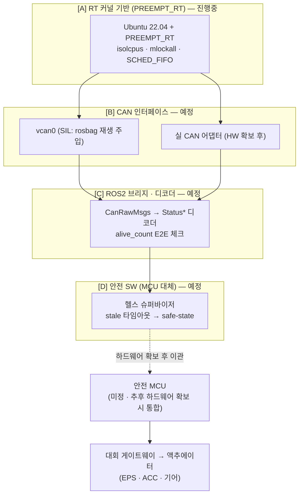
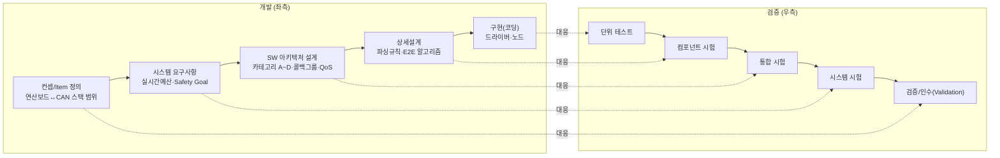

# CAN 스택 개발 문서 (메인 PC ↔ CAN)

> **이 문서의 역할**: 앞으로 이 프로젝트의 "바이브 코딩" 개발 세션이 참조하는 **살아있는 구현 스펙**. "왜 이렇게 설계했는가"의 근거·HARA 분석 전체는 [can_status_parameters_full.md](can_status_parameters_full.md)에 있고, 진행보드 Action Item은 같은 파일 §14에 있음. 이 문서는 **"무엇을·어떤 구조로 구현하는가"만** 담아 코딩 시 컨텍스트로 바로 쓸 수 있게 유지한다.
>
> **갱신 규칙**: 카테고리(§2) 단위로 섹션을 늘려간다. 새 내용을 추가할 때도 이 구조(아키텍처 다이어그램 → 카테고리 표 → 카테고리별 상세)를 유지할 것 — 흩어진 노트 형태로 쌓지 않는다.

---

## 0. 범위와 전제

- **하드웨어 부재**: 안전 MCU·실차 CAN 게이트웨이 아직 없음 → 메인 PC(Ubuntu 22.04)가 [8.1 연산보드 계층](can_status_parameters_full.md#81-권장-2계층-아키텍처)을 **단독으로** 구현하는 첫 마일스톤.
- **PREEMPT_RT 설치 진행 중.**
- **개발 방식 = SIL(Software-in-the-Loop)**: 실물 CAN 대신 `vcan0` 가상 인터페이스 + 기록된 rosbag 재생으로 검증. 대회 DBC·실차 미수령.
- **대회 미수령 항목**: CAN ID 배치, 정수값→의미 매핑표(`enable`/`state`/`error*`/`gear`/`drive_mode`) — 확정 전까지 TODO로 명시하며 진행.

---

## 1. 아키텍처 개요



각 `[X]` 태그는 §2 카테고리 ID와 1:1 대응한다. 새 구현 내용은 반드시 이 다이어그램의 해당 박스를 갱신하고 §2 표의 상태를 바꾼 뒤, 대응 카테고리 섹션에 상세를 적는다.

---

## 2. 개발 카테고리

| ID | 카테고리 | 책임 범위 | 상태 | 상세 섹션 |
|---|---|---|---|---|
| A | RT 커널 기반 | PREEMPT_RT 설치·튜닝(`isolcpus`/`mlockall`/`SCHED_FIFO`), `cyclictest` 측정 | 🟡 진행중 | §5.A (추후 작성) |
| B | CAN 인터페이스 | 어댑터/SocketCAN, `vcan0` SIL 환경, rosbag→CAN 주입 | ⚪ 예정 | §5.B (추후 작성) |
| C | ROS2 브리지·디코더 | `CanRawMsgs`→`Status*` 파싱, E2E(`alive_count`) 체크, 콜백그룹/QoS | ⚪ 예정 | §5.C (추후 작성) |
| D | 안전 SW (MCU 대체) | 헬스 슈퍼바이저, stale 타임아웃→safe-state, HW 워치독 대체안 | ⚪ 예정 | §5.D (추후 작성) |
| E | 검증/테스트 (V-model) | 좌/우 대응 검증 계획, 고장주입 시험 | 🟢 초안 완료 | §3 |
| F | 안전등급 레퍼런스 (ASIL) | 41개 파라미터 ASIL 등급, 근거 | 🟢 초안 완료 | §4 |

상태 기호: 🟢 초안 있음 · 🟡 진행중 · ⚪ 미착수.

---

## 3. [E] V-model 검증 체크리스트

> HW 부재 단계라 우측 대부분은 **SIL(`vcan0`+rosbag 재생)** 수준. HIL/실차 시험은 MCU·실차 하드웨어 확보 후 별도 마일스톤으로 분리한다.



| 좌측 단계 | 이번 마일스톤 산출물 | 우측 검증 단계 | 검사 항목 |
|---|---|---|---|
| 컨셉/Item 정의 | "메인 PC↔CAN 인터페이스" 범위·경계 | 검증/인수 | rosbag 재생 시나리오로 전체 파이프라인이 원본 기록과 동등한 상태를 재현하는가 |
| 시스템 요구사항 (FSR 수준) | 실시간 예산표, Safety Goal | 시스템 시험 | `cyclictest`·ROS2 토픽 지연 실측이 데드라인 이내인가; `uname -a`/`/sys/kernel/realtime`로 PREEMPT_RT 적용 확인 |
| SW 아키텍처 설계 | 카테고리 A~D 구조, 콜백그룹 분리, QoS | 통합 시험 | `vcan0`+rosbag 주입 → 디코더 노드 전 구간 그래프 정상 동작; 제어 콜백이 인지/로깅 콜백에 안 밀리는지 |
| 상세설계 | CAN 프레임→구조체 파싱 규칙, E2E 체크 | 컴포넌트 시험 | 파서 단위 테스트(경계값), `alive_count` 롤오버(255→0) 테스트, 타임아웃 판정 로직 테스트 |
| 구현(코딩) | 드라이버 설치, 노드 코드 | 단위 테스트 | 정적분석(clang-tidy 등), 코드리뷰, CI 빌드 통과 |

**고장주입(fault injection) 시험 — H8/E2E 대응 필수 항목**
- [ ] CAN 프레임 드롭 주입 → safe-state 전환 시간 측정 (목표 ≤100 ms, H8)
- [ ] `alive_count` 고정(stuck) 주입 → 통신 두절 탐지 여부
- [ ] 체크섬/CRC 손상 프레임 주입 → 거부 여부
- [ ] 조향각/좌표 등 out-of-range 값 주입 → 범위 검증 로직 동작 확인
- [ ] 상위(Linux) 프로세스 강제 종료 → 폴백 로직(또는 향후 MCU 폴백) 트리거 확인

---

## 4. [F] ASIL 등급표 — 41개 통신 파라미터 (관례 기반)

**산정 방법(관례)**: ISO 26262는 원래 Safety Goal 단위로 ASIL을 부여하고 요구사항으로 하향 전개하는 것이 정석. 아래는 실무 편의상 각 파라미터를 [H1~H9](can_status_parameters_full.md#64-이-차량-hara-초안)(또는 토픽별 ASIL 맥락)에 **직접 매핑**해 상속시킨 간이표. 같은 필드명이 서로 다른 ASIL 도메인 메시지에 걸쳐 있으면(`enable`/`speed`/`accel`/`steer_angle` 등) **더 보수적인(높은) 등급을 채택**. 공식 HARA·대회 DBC 확정 전까지 **가정치**.

| # | 파라미터 | 소속 메시지 | 관련 Hazard | ASIL(관례) | 근거 |
|---|---|---|---|---|---|
| 1 | `is_init` | EPS/ACC | H1/H2 | **D** | 안전제어 활성화 게이팅 신호, 두 도메인 모두 D |
| 2 | `enable` | EPS/ACC | H1/H2 | **D** | 제어 활성화 상태 |
| 3 | `state` | EPS/ACC | H1/H2 | **D** | 상태머신 값 |
| 4 | `sequence` | EPS/ACC | H1/H2 | **D** | 제어 시퀀스 단계 |
| 5 | `error` | EPS/ACC | H1/H2 | **D** | 통합 에러 플래그 |
| 6 | `error_pd` | EPS/ACC | H1/H2 | **D** | 제어기(PD) 에러 |
| 7 | `error_sas` | EPS | H1 | **D** | 조향각센서 에러 |
| 8 | `error_vinfo` | EPS | H1 | **D** | 차량정보 에러 |
| 9 | `override` | EPS | H1 | **D** | 운전자 개입 감지 |
| 10 | `override_ignore` | EPS | H1 | **D** | 개입 무시 설정 |
| 11 | `steer_angle` | EPS(D)/Vehicle(C) | H1 | **D** | 보수적 상위값 채택 |
| 12 | `steer_torque` | EPS | H1 | **D** | 측정 조향 토크 |
| 13 | `steer_out_torque` | EPS | H1 | **D** | 출력 조향 토크 |
| 14 | `alive_count` | EPS/ACC(D)+INS(C) | H1/H2/H8 | **D**† | E2E 보호대상 최고등급 기준(† INS 단독 인스턴스는 C) |
| 15 | `error_tcu` | ACC | H4 | **B–C** | 변속기(TCU) 에러 — gear 오선택 계열 |
| 16 | `aeb_sequence` | ACC | H2/H3 | **D** | AEB 미작동=H2(D)가 보수적 상위 |
| 17 | `speed` | ACC(D)/Vehicle(C) | H2 | **D** | 보수적 상위값 채택 |
| 18 | `accel` | ACC(D)/Vehicle(C) | H2 | **D** | 보수적 상위값 채택 |
| 19 | `gear` | ACC | H4 | **B–C** | 기어 오선택, TCU inhibit 확인 시 완화 가능 |
| 20 | `accel_position` | Pedal | — | **B** | 피드백 전용 신호 등급 |
| 21 | `accel_switch` | Pedal | — | **B** | 〃 |
| 22 | `brake_position` | Pedal | — | **B** | 〃 |
| 23 | `brake_switch` | Pedal | — | **B** | 〃 |
| 24 | `brake_pressure` | Pedal | — | **B** | 〃 |
| 25 | `left`(방향지시등) | Turn | H9 | **QM–A** | 등화 |
| 26 | `right`(방향지시등) | Turn | H9 | **QM–A** | 등화 |
| 27 | `emergency`(비상등) | Turn | H9 | **QM–A** | 등화 |
| 28 | `front_left`(휠속) | Wheel | H6 보조 | **C** | 휠 오도메트리 등급 |
| 29 | `front_right`(휠속) | Wheel | H6 보조 | **C** | 〃 |
| 30 | `rear_left`(휠속) | Wheel | H6 보조 | **C** | 〃 |
| 31 | `rear_right`(휠속) | Wheel | H6 보조 | **C** | 〃 |
| 32 | `yaw_rate` | INS | H6 | **C** | H6 자체는 C–D 범위, 팀 재확인 필요 |
| 33 | `filtered_yaw_rate` | Vehicle | H6 | **C** | 통합상태 HUD 등급 |
| 34 | `pos_x` | Vehicle | H6 | **C** | 〃 |
| 35 | `pos_y` | Vehicle | H6 | **C** | 〃 |
| 36 | `heading` | Vehicle | H6 | **C** | 〃 |
| 37 | `drive_mode` | std_msgs | H7 | **D** | 모드 중재 |
| 38 | `current_angle` | std_msgs (피드백) | H1 검증 | **C** | 명령 반영 확인 |
| 39 | `current_speed` | std_msgs (피드백) | H2 검증 | **C** | 〃 |
| 40 | `target_angle` | std_msgs (명령 에코) | H1 검증 | **C** | 〃 |
| 41 | `target_speed` | std_msgs (명령 에코) | H2 검증 | **C** | 〃 |

**등급별 집계**: D 18개 · C 13개 · B 5개 · B–C 2개 · QM–A 3개 (합계 41)

> ⚠️ ISO 26262 정석은 신호가 아니라 Safety Goal에 ASIL을 매기고, 이후 **ASIL 분해(decomposition)**로 하위 요소 등급을 낮출 수 있음. 위 표는 그 전 단계의 실무 간이 매핑. 공식 HARA 확정 시 특히 `alive_count`(EPS/ACC vs INS 분리 여부)·`error_tcu`/`gear`(TCU inhibit 여부)·`yaw_rate`(H6 C 대 C–D)는 재검토 1순위.

---

## 5. 카테고리별 상세 — 추후 작성

구현이 진행되는 대로 아래 형식으로 채운다: **목적 → 인터페이스(토픽/함수 시그니처) → 파일/모듈 위치 → 완료 기준(§3 검증 항목과 연결)**.

### 5.A RT 커널 기반

**왜 필요한가**
- Vanilla 리눅스 스케줄러(CFS)는 처리량·공정성 최적화 → 개별 태스크의 **최악 지연(worst-case latency)** 보장이 없음.
- 지연 원인: 커널 비선점 구간(스핀락 보유 중엔 인터럽트도 못 끼어듦) · 인터럽트 핸들러가 우선순위 무관하게 즉시 실행 · 우선순위 역전(priority inversion, 낮은 우선순위 태스크가 잡은 락을 높은 우선순위 태스크가 기다리는데 중간 우선순위 태스크가 낮은 쪽을 밀어냄) · `SCHED_OTHER`(CFS)의 스케줄링 지터.
- 이 프로젝트 영향: 제어 루프 10ms, E2E 브리지 100Hz 등 §7 데드라인을 지키려면 **평균이 아니라 99.9퍼센타일/최댓값**이 예산 안에 들어야 함. 200km/h에서 100ms 지연 = 5.6m 블라인드 — vanilla 커널의 수~수십 ms 스파이크는 이 속도대에서 그대로 사고 리스크.

**PREEMPT_RT가 바꾸는 것**
- 대부분의 스핀락 → 선점 가능한(sleepable) 뮤텍스
- 인터럽트 핸들러 → 우선순위 지정 가능한 커널 스레드(threaded IRQ), `chrt`로 우리 제어 태스크보다 낮게 배치 가능
- 우선순위 상속(priority inheritance)으로 우선순위 역전 방지
- 효과: 최악 스케줄링 지연 수 ms~수십 ms → **수십~100 µs 급**. Linux 6.12에 메인라인 병합됨.

**RT 커널만으로는 부족 — 반드시 같이 적용**
- 임계 태스크에 `SCHED_FIFO`/`SCHED_DEADLINE` + `chrt`로 명시적 우선순위 부여
- `isolcpus`/`nohz_full`/`rcu_nocbs` + IRQ affinity로 RT 태스크 전용 격리코어 확보
- `mlockall(MCL_CURRENT|MCL_FUTURE)`로 페이지폴트(=디스크 I/O=수 ms 지연) 원천 차단
- `cyclictest`로 반드시 실측 — "커널 깔았다"가 완료가 아니라 "쟀더니 목표치 이내였다"가 완료

**검증 방법**
- `uname -a`에 `PREEMPT_RT` 표기 확인, `cat /sys/kernel/realtime` → `1`
- `cyclictest -p 99 -m -N -i 1000 -l 100000` 등으로 **무부하 상태 + 부하 상태(카메라/LiDAR 처리 흉내로 CPU/메모리 스트레스)** 양쪽에서 최댓값 비교
- §3 V-model "시스템 요구사항 ↔ 시스템 시험" 행과 직결

**완료 기준**: PREEMPT_RT 부팅 확인 + 무부하/부하 상태 `cyclictest` 최댓값을 기록하고 §7(can_status_parameters_full.md) 데드라인과 대조해 여유가 있음을 확인.

**cyclictest 실측 절차 (2026-09-11 수정: before/after 비교 생략, PREEMPT_RT 설치 후 절대 기준(§7 예산) 통과 여부만 확인)**

> 📝 판단 기준을 "RT 전/후 비교"에서 **"RT 후 값이 요구사항(§7)을 만족하는가"**로 단순화함 (팀 결정, 2026-09-11). vanilla 커널로는 이미 실시간성 보장이 안 된다는 게 업계에 잘 알려져 있어 굳이 증명할 필요 없음 — 지금 급한 건 "우리 목표치를 만족하는 바닥선이 나오는가"뿐. GRUB에 이전 커널이 그대로 남아있으므로, 나중에 보고서 등에서 정말 전/후 비교가 필요해지면 그때 옛 커널로 재부팅해서 재측정하면 됨 (지금 손해보는 것 없음).

**Step 0 — PREEMPT_RT 커널로 실제 부팅됐는지 확인** (설치했다고 자동으로 그걸로 부팅되는 게 아님, GRUB에서 커널을 고르는 것)
```bash
uname -r                     # 이름에 rt가 들어있는지 확인
cat /sys/kernel/realtime     # 파일이 없으면 RT 아님, 1이 나오면 RT로 부팅된 것
```

**Step 1 — cyclictest 설치**
```bash
sudo apt update && sudo apt install -y rt-tests
```

**Step 2 — 감 잡기용 최소 실행** (Ctrl+C로 종료)
```bash
sudo cyclictest
```

**Step 3 — 실제로 판단에 쓸 측정** (8코어, 약 100초)
```bash
sudo cyclictest -p 99 -m -N -i 1000 -l 100000 -t 8 -a -q -h 400 > ~/cyclictest_rt_floor_$(date +%Y%m%d).log
tail -n 20 ~/cyclictest_rt_floor_*.log
```

**Step 4 — 부하 상태에서도 확인** (카메라/LiDAR 처리 흉내)
```bash
sudo apt install -y stress-ng
sudo stress-ng --cpu 8 --io 4 --vm 2 --vm-bytes 1G --timeout 70s &
sudo cyclictest -p 99 -m -N -i 1000 -l 60000 -t 8 -a -q -h 400 > ~/cyclictest_rt_floor_load_$(date +%Y%m%d).log
```

- 판단 기준은 각 스레드의 `Max`(최악 지연) — `Avg` 아님. 사고는 꼬리(tail)에서 남.
- 8개 스레드 중 **가장 큰 Max**가 "이 컴퓨터+이 커널이 보장하는 실시간성의 바닥선".

| 상태 | 무부하 Max | 부하상태 Max | 측정일 | 커널 |
|---|---|---|---|---|
| RT 커널 (§7 목표: 수십~100µs 급) | _TBD_ | _TBD_ | _TBD_ | _TBD_ |

---

### 5.B CAN 인터페이스 (vcan0)

**vcan0이 뭔가**
- Linux 커널의 `vcan` 드라이버가 만드는 **순수 소프트웨어 CAN 인터페이스**. 물리 CAN 트랜시버·어댑터 없이 SocketCAN API(AF_CAN 소켓, `candump`/`cansend`, `ip link`)를 실물 인터페이스와 동일하게 사용.
- 실제 버스가 아니라 **로컬 루프백**: 이 인터페이스에 쓴 프레임은 같은 인터페이스를 구독하는 모든 소켓에 즉시 전달됨. CAN의 브로드캐스트 특성은 흉내 내지만, 물리 버스의 전송지연·비트레이트·중재(arbitration)는 없음.

**생성 방법**
```bash
sudo modprobe vcan
sudo ip link add dev vcan0 type vcan
sudo ip link set up vcan0
```

**왜 지금 쓰는가 (HW 부재 단계)**
1. CAN 어댑터·실차 없이 ROS2↔CAN 브리지, 디코더 노드, E2E(`alive_count`) 체크, 헬스 슈퍼바이저를 개발·테스트 가능 (SIL, Software-in-the-Loop)
2. 확보된 rosbag 데이터를 vcan0에 재주입 → 파이프라인 전체를 실주행과 유사한 입력으로 검증 (Epic B 목표)
3. 고장주입(프레임 드롭·`alive_count` 고정·체크섬 손상 등, §3 고장주입 시험)을 스크립트로 완전히 제어 가능 → 재현 가능한 테스트
4. 실물 어댑터 확보 후에는 **인터페이스 이름만 `can0`로 교체** — SocketCAN이 물리/가상 인터페이스에 동일한 API를 제공하므로 ROS2 노드·드라이버 코드는 수정 불필요

**한계 (중요 — 이것 때문에 SIL ≠ HIL)**
- 물리 버스 전송지연·비트레이트·ID 기반 중재(arbitration) 시간이 없음 → vcan0에서 잰 지연은 실제보다 낙관적. **최종 실시간성 검증은 실물 CAN 확보 후 재측정 필수**
- 에러 프레임·버스-오프(bus-off)·전기적 결함(단선, 노이즈) 시뮬레이션 안 됨 → 이런 고장은 애플리케이션 레이어에서 소프트웨어적으로만 흉내 가능
- 여러 노드 간 ID 기반 우선순위 경쟁이 실제로 일어나지 않음 (모든 프레임이 즉시 전달됨)

**~~현재 막힌 지점~~ → 2026-09-11 해소**: `merged_0.mcap` 원본은 여전히 미보유지만, **실제 대회/차량 DBC를 확보함** — `can_protocol/00. CAN 프로토콜/EAIT_CAN(AVANTE_CN7).dbc` (+ 동일 폴더의 PDF 비트맵 스펙, PPTX 운용 매뉴얼). 합성 프레임 단계를 건너뛰고 바로 실제 프로토콜로 vcan0 개발 가능.

**완료 기준**: `vcan0` 기동 + `candump vcan0`/`cansend vcan0` 왕복 확인 + (아래 DBC 기반) 재생 스크립트로 `/interface/can/read/raw` 퍼블리시 확인.

---

**✅ 실제 프로토콜 스펙 — `EAIT_CAN(AVANTE_CN7).dbc` (2026-09-11 확보)**

차량: 현대 아반떼 CN7 + EAIT DBW 개조 키트. **버스**: 500kbps · Little-endian(Intel) · 노드 3개(`EAIT`=DBW 제어유닛, `USER`=우리 메인PC, `KIAPI`=예약/용도 미상).

| ID(hex) | 이름 | 방향 | 주기 | 타임아웃 | 핵심 필드 |
|---|---|---|---|---|---|
| 0x156 | EAIT_Control_01 | TX(우리→차량) | 10ms | 1000ms | EPS_En, ACC_En, AEB_En, Turn_Signal, AEB_decel_value, Alive_Cnt |
| 0x157 | EAIT_Control_02 | TX | 10ms | 없음(0x156 종속) | EPS_Cmd(조향각), ACC_Cmd(가감속) |
| 0x710 | EAIT_INFO_EPS | RX(차량→우리) | 20ms | 1000ms | En/Control_Board/Control_Status, ERR 4종, Override*, StrAng, Str_Drv/Out_Tq, Alive_Cnt |
| 0x711 | EAIT_INFO_ACC | RX | 10ms | 없음(0x156 종속) | En/Control_Board/Control_Status, ERR 3종, VS, Long_Accel, Turn/Hazard_En, G_SEL_DISP, Alive_Cnt |
| 0x712 | EAIT_INFO_SPD | RX | 10ms | 없음 | WHEEL_SPD_FL/FR/RL/RR (필드 4개뿐, 가장 단순) |
| 0x713 | EAIT_INFO_IMU | RX | 10ms | 없음 | LAT_ACCEL, Long_ACCEL, YAW_RATE, BRK_CYLINDER |
| 0x124~0x129 | KIAPI_1~6 | ? | ? | ? | 신호 정의 없음 — 빈 예약 메시지, 용도 확인 필요 |

**새로 확정된 것**: `EPS/ACC_Control_Status` = 0:None,1:Ready,2:All On,3:ACC On,4:Steer On,그외:error / `G_SEL_DISP`(기어) P=0x0,R=0x7,N=0x6,D=0x5(비순차) / 0x156 1000ms 두절 시 `USER_CAN_ERR`→**차량 하드웨어가 자동 AEB 발동**(벤더 내장 fail-safe, 우리 SW 폴백과 이중 구조).

**⚠️ 발견된 불일치 — 팀 확인 필요**:
1. `Turn_Signal` 값 매핑이 DBC `VAL_`(2=좌,4=우)와 PDF 설명(0x02=우,0x04=좌)이 **반대** — 상수로 분리, 하드코딩 금지
2. `status/acc`·`status/wheel`: rosbag 관측 20ms(50Hz) vs 이 스펙 10ms(100Hz) — 실물로 재확인
3. 종방향 가속도가 0x711(`Long_Accel`, ACC모듈 추정치)과 0x713(`Long_ACCEL`, IMU 실측치) **두 곳**에서 옴 — 사용/크로스체크 정책 필요
4. `StatusPedal` 신호가 이 DBC엔 없음(orphan 신호로만 존재) → 순정 OEM 버스 소스로 추정, DBW 모드에선 우선순위 낮음
5. 고아 신호에 **레이더**(`RAD_ObjRelSpd`/`Dist`/`LatPos`/`State`) 존재 — 기존 문서엔 카메라·LiDAR만 언급, 실제 장착 여부 확인 필요
6. `KIAPI_1~6`(0x124~0x129) 용도 불명 — 대회 게이트웨이/조직위 예약 가능성

**vcan0 실전 스크립트 (cantools + python-can, 합성 데이터 아닌 실제 프로토콜)**
```bash
pip install --user cantools python-can
```
```python
import cantools, can, time

db = cantools.database.load_file("can_protocol/00. CAN 프로토콜/EAIT_CAN(AVANTE_CN7).dbc")
bus = can.interface.Bus(channel="vcan0", bustype="socketcan")

msg_def = db.get_message_by_name("EAIT_INFO_SPD")   # 0x712 — 가장 단순, 걷기골격 1번 타겟
data = msg_def.encode({"WHEEL_SPD_FL": 12.3, "WHEEL_SPD_FR": 12.1, "WHEEL_SPD_RL": 12.0, "WHEEL_SPD_RR": 12.2})
frame = can.Message(arbitration_id=msg_def.frame_id, data=data, is_extended_id=False)

while True:
    bus.send(frame)
    time.sleep(0.01)   # 10ms, 스펙과 동일
```
받는 쪽에서 `db.decode_message(0x712, data)`로 역디코딩해 물리값이 나오면 검증 완료.

---

### 5.C ROS2 브리지·디코더
_(추후 작성 — 노드/패키지 구조, 토픽 인터페이스, 정수→의미 매핑표 확정본)_

### 5.D 안전 SW (MCU 대체)
_(추후 작성 — 헬스 슈퍼바이저 상태머신, 타임아웃 값, safe-state 진입 로직)_

---

## 6. 권장 개발 순서 (Walking Skeleton) — 2026-09-11 초안

**원칙**: 카테고리(A~D)를 각각 "완성"한 뒤 다음으로 넘어가지 않는다. **메시지 1종을 vcan0 → 디코더 → ROS2 토픽까지 끝까지 관통시키는 얇은 수직 슬라이스**를 먼저 완성해 전체 파이프라인이 실제로 도는지부터 확인하고, 이후 나머지 메시지 타입·안전 로직으로 넓힌다. (전 계층을 각각 다 만들고 나중에 연결하면 통합 시점에야 문제가 드러남 — 그걸 피하기 위한 순서.)

1. **[A] RT 커널 검증** — §5.A 완료 기준 충족 ("설치함"이 아니라 "쟀음")
2. **[B] vcan0 환경 구성** — `candump`/`cansend` 왕복 확인
3. **[B] 최소 재생 스크립트** — `EAIT_CAN(AVANTE_CN7).dbc`를 `cantools`로 로드해 가장 단순한 메시지 `EAIT_INFO_SPD`(0x712, 필드 4개) 1종을 vcan0에 10ms 주기 송신 (2026-09-11: 실 DBC 확보로 `StatusTurn`에서 변경 — Turn 신호는 독립 메시지가 아니라 0x711 안의 비트필드였음)
4. **[C] 최소 브리지+디코더 1종** — `/interface/can/read/raw` 퍼블리시 → `EAIT_INFO_SPD` 디코더 노드(`cantools.decode_message` 또는 직접 파싱) → `/control/status/wheel` 퍼블리시까지 관통 확인 (여기서 처음으로 "끝까지 됨"이 검증됨)
5. **[E] 이 슬라이스에 대해 `cyclictest` + ROS2 토픽 hz/지연 측정** — §3 V-model "통합 시험" 행 충족
6. **[C] 나머지 메시지로 확장** — EPS/ACC(안전 임계, ASIL D) 우선 → Pedal/Wheel/INS/Vehicle 순
7. **[D] E2E(`alive_count`) 체크 + 헬스 슈퍼바이저 최소 버전** — §3 고장주입 시험 착수
8. **[B] 실 CAN 어댑터 확보 시** — `vcan0`→`can0` 전환, HIL 재측정으로 SIL 결과 재검증

이 순서를 따르면 매 단계가 §3 V-model 표의 검증 항목을 하나씩 채워나가는 구조가 된다.
